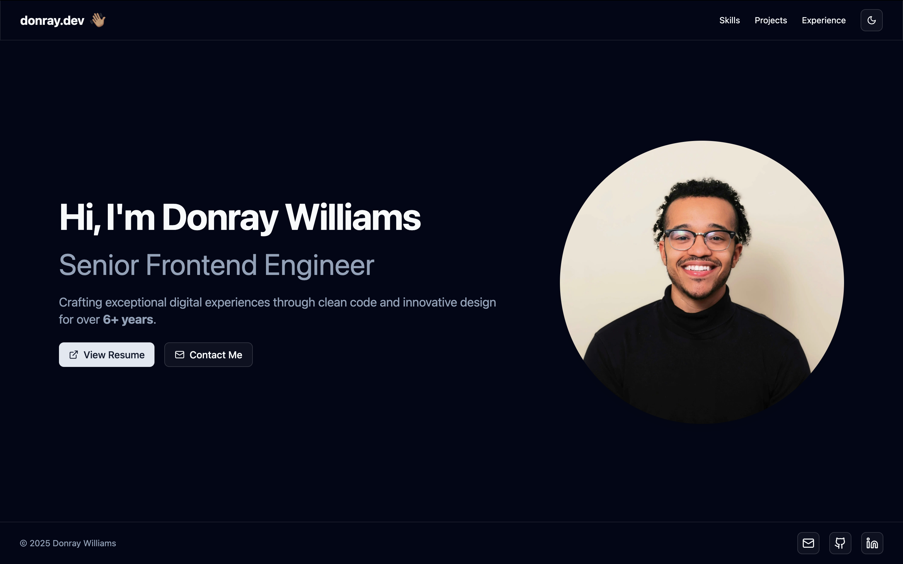
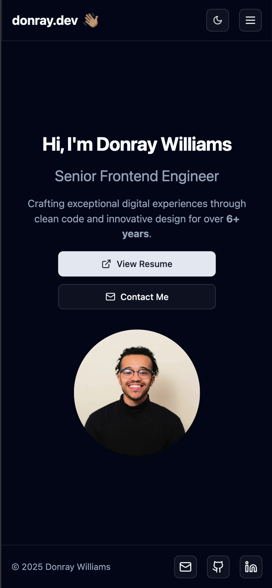

# Donray Williams - Portfolio Website

A modern, responsive portfolio website built with Next.js, TypeScript, and Tailwind CSS. This portfolio showcases my professional experience, projects, and skills with a focus on frontend development.

## 📸 Site Preview

<div align="center">
  <h3>Desktop View</h3>
  
  
  <h3>Mobile View</h3>
  
</div>

## 🌟 Features

- **Modern Design**: Clean and professional layout with smooth animations
- **Responsive**: Fully responsive design that works on all devices
- **Dark Mode**: Built-in dark/light mode support
- **Accessibility**: WCAG compliant with proper ARIA labels and semantic HTML
- **Performance**: Optimized for speed with Next.js and static generation
- **Animations**: Smooth scroll animations using Framer Motion
- **Components**: Built with shadcn/ui for consistent design

## 🛠️ Tech Stack

- **Framework**: Next.js 14
- **Language**: TypeScript
- **Styling**: Tailwind CSS
- **UI Components**: shadcn/ui
- **Animations**: Framer Motion
- **Icons**: Lucide React
- **Deployment**: Vercel

## 🚀 Getting Started

### Prerequisites

- Node.js 18.17 or later
- npm or yarn

### Installation

1. Clone the repository:

   ```bash
   git clone https://github.com/wdonray/donray.dev.git
   ```

2. Navigate to the project directory:

   ```bash
   cd donray.dev
   ```

3. Install dependencies:

   ```bash
   npm install
   # or
   yarn install
   ```

4. Start the development server:

   ```bash
   npm run dev
   # or
   yarn dev
   ```

5. Open [http://localhost:3000](http://localhost:3000) in your browser.

## 📁 Project Structure

```
src/
├── app/                 # Next.js app directory
├── components/         # React components
│   ├── ui/            # shadcn/ui components
│   ├── header.tsx     # Navigation header
│   ├── hero.tsx       # Hero section
│   ├── experience.tsx # Experience section
│   ├── projects.tsx   # Projects section
│   ├── skills.tsx     # Skills section
│   └── footer.tsx     # Footer component
├── lib/               # Utility functions
└── styles/            # Global styles
```

## 🎨 Customization

### Theme

The website uses a custom theme with primary colors and dark mode support. You can modify the theme in `tailwind.config.js`.

### Content

Update the content in the respective component files:

- `src/components/hero.tsx` - Hero section content
- `src/components/experience.tsx` - Experience timeline
- `src/components/projects.tsx` - Project showcase
- `src/components/skills.tsx` - Skills and expertise

## 📱 Responsive Design

The website is fully responsive with breakpoints for:

- Mobile: < 768px
- Tablet: 768px - 1024px
- Desktop: > 1024px

## 🚀 Deployment

The website is deployed on Vercel. To deploy your own version:

1. Push your code to GitHub
2. Connect your repository to Vercel
3. Deploy with the following settings:
   - Framework Preset: Next.js
   - Build Command: `next build`
   - Output Directory: `.next`

## 🤝 Contact

- LinkedIn: [Donray Williams](https://www.linkedin.com/in/donrayxwilliams/)
- GitHub: [wdonray](https://github.com/wdonray)
- Website: [donray.dev](https://donray.dev)
